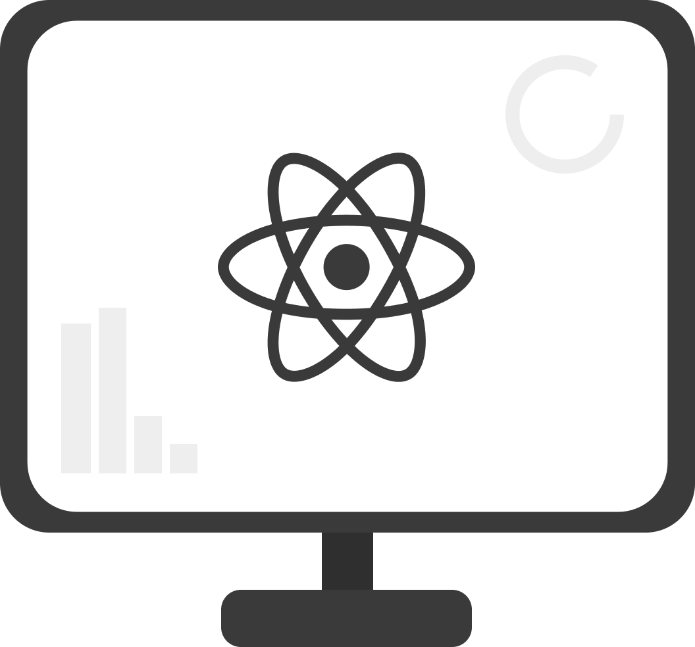

# React Open Dashboard

 

The React Open Dashboard is a versatile and inclusive platform that empowers users to kickstart their projects with ease. It provides an array of customizable tools that can be tailored to meet diverse project needs, ensuring flexibility and adaptability. By embracing an open approach, this dashboard allows for seamless collaboration and encourages innovation by fostering a community of like-minded individuals. Whether you're a seasoned developer or just starting out, the React Open Dashboard has everything you need to bring your ideas to life.